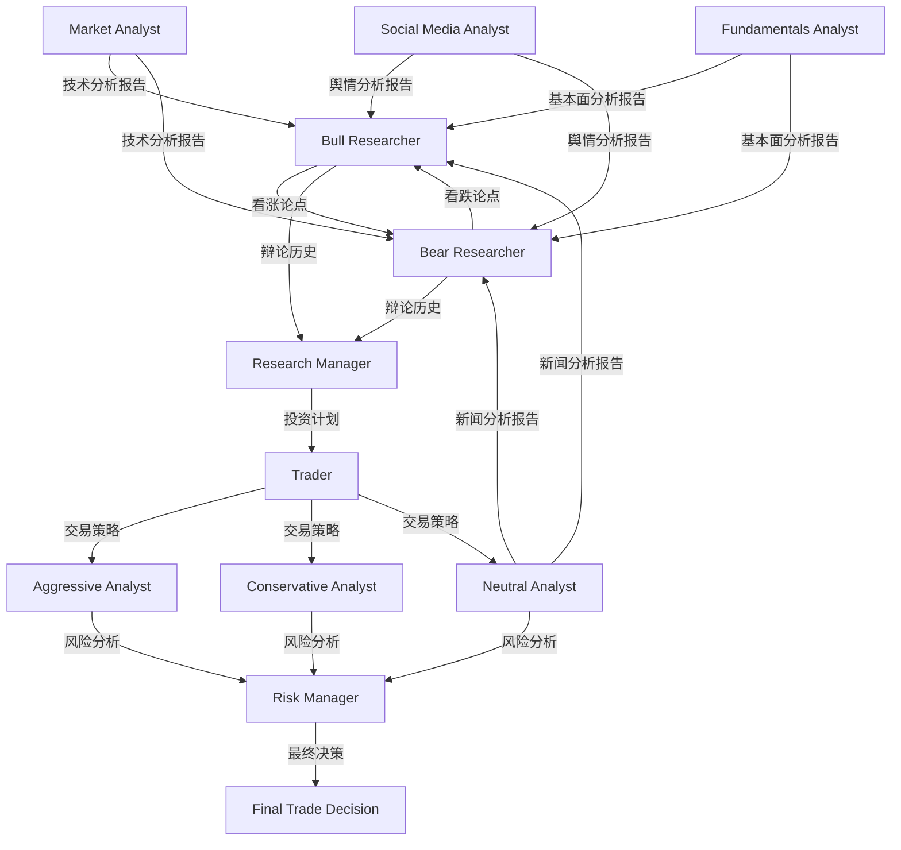
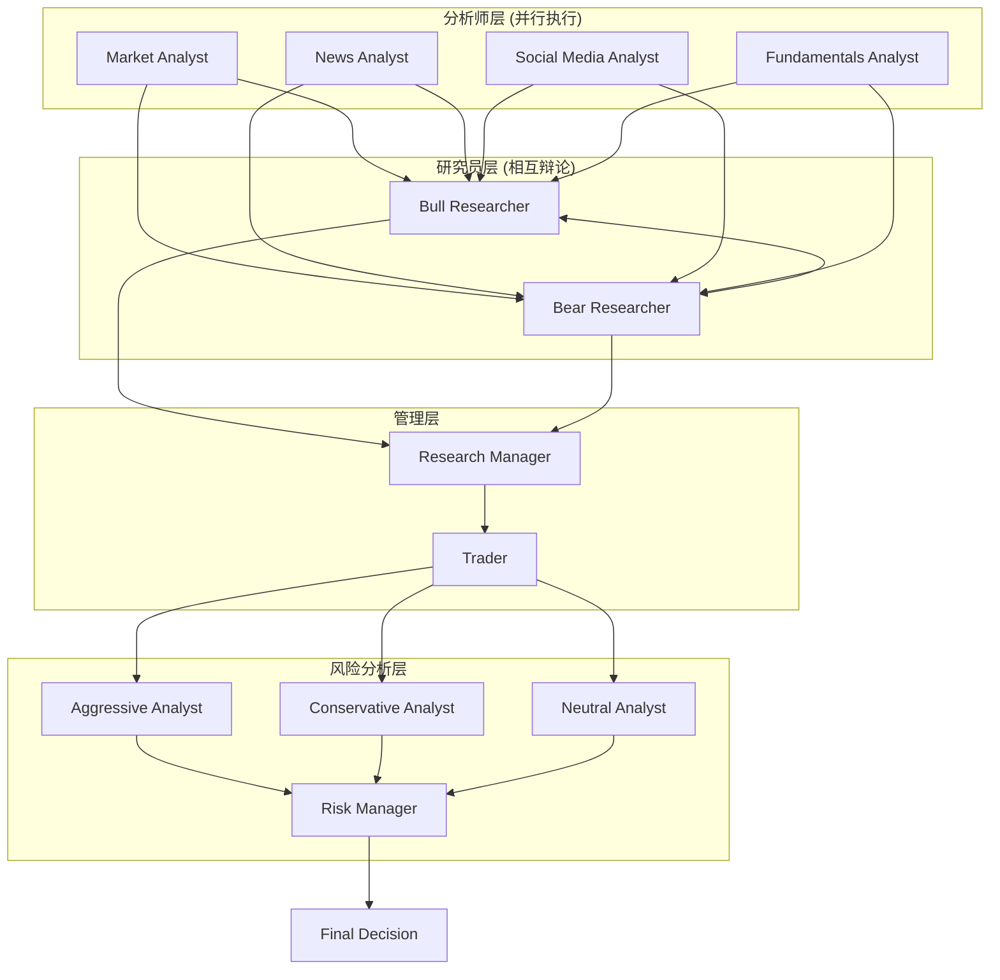

# TradingAgents Agent关系矩阵

## Agent基本信息表

| Agent名称 | 文件路径 | 类型 | 主要职责 | 输入数据源 | 输出结果 | 使用工具 | 内存系统 |
|-----------|----------|------|----------|------------|----------|----------|----------|
| Market Analyst | `analysts/market_analyst.py` | 分析师 | 技术面分析和指标选择 | 股票数据、技术指标 | `market_report` | `get_stock_data`, `get_indicators` | 无(由下游使用) |
| News Analyst | `analysts/news_analyst.py` | 分析师 | 宏观新闻和全球经济分析 | 新闻数据、全球新闻 | `news_report` | `get_news`, `get_global_news` | 无 |
| Social Media Analyst | `analysts/social_media_analyst.py` | 分析师 | 社交媒体情绪和舆论分析 | 新闻和社交媒体数据 | `sentiment_report` | `get_news` | 无 |
| Fundamentals Analyst | `analysts/fundamentals_analyst.py` | 分析师 | 公司基本面和财务分析 | 财务数据、报表数据 | `fundamentals_report` | `get_fundamentals`, `get_balance_sheet`, `get_cashflow`, `get_income_statement` | 无 |
| Bull Researcher | `researchers/bull_researcher.py` | 研究员 | 构建看涨投资论点 | 所有分析师报告、熊市论点、历史记忆 | `investment_debate_state.bull_history` | 无 | `bull_memory` |
| Bear Researcher | `researchers/bear_researcher.py` | 研究员 | 构建看跌投资论点 | 所有分析师报告、牛市论点、历史记忆 | `investment_debate_state.bear_history` | 无 | `bear_memory` |
| Research Manager | `managers/research_manager.py` | 管理者 | 投资辩论主持和决策 | 双方辩论历史、所有分析报告、历史记忆 | `investment_debate_state.judge_decision`, `investment_plan` | 无 | `invest_judge_memory` |
| Trader | `trader/trader.py` | 执行者 | 制定具体交易策略 | 投资计划、所有分析报告、历史记忆 | `trader_investment_plan` | 无 | `trader_memory` |
| Aggressive Analyst | `risk_mgmt/aggressive_debator.py` | 风险分析师 | 高风险高回报策略 | 交易计划、分析报告 | `risk_debate_state`更新 | 无 | 无 |
| Conservative Analyst | `risk_mgmt/conservative_debator.py` | 风险分析师 | 低风险稳健策略 | 交易计划、分析报告 | `risk_debate_state`更新 | 无 | 无 |
| Neutral Analyst | `risk_mgmt/neutral_debator.py` | 风险分析师 | 平衡风险收益策略 | 交易计划、分析报告 | `risk_debate_state`更新 | 无 | 无 |
| Risk Manager | `managers/risk_manager.py` | 风险管理者 | 最终风险评估和交易决策 | 风险辩论历史、交易计划、分析报告、历史记忆 | `final_trade_decision` | 无 | `risk_manager_memory` |

## 数据依赖关系图

## Agent间通信关系图

## 工具使用统计表

| Agent类别 | 使用工具数量 | 工具名称 | 工具功能描述 |
|-----------|-------------|----------|--------------|
| Market Analyst | 2 | `get_stock_data` | 获取股票价格、成交量等基础数据 |
| | | `get_indicators` | 计算各种技术指标(MA、MACD、RSI等) |
| News Analyst | 2 | `get_news` | 搜索特定公司的新闻和公告 |
| | | `get_global_news` | 获取宏观经济和全球新闻 |
| Social Media Analyst | 1 | `get_news` | 搜索社交媒体相关讨论和情绪 |
| Fundamentals Analyst | 4 | `get_fundamentals` | 获取公司基本财务信息 |
| | | `get_balance_sheet` | 获取资产负债表数据 |
| | | `get_cashflow` | 获取现金流量表数据 |
| | | `get_income_statement` | 获取损益表数据 |
| Bull Researcher | 0 | - | 仅使用其他Agent的输出和内存 |
| Bear Researcher | 0 | - | 仅使用其他Agent的输出和内存 |
| Research Manager | 0 | - | 仅使用其他Agent的输出和内存 |
| Trader | 0 | - | 仅使用其他Agent的输出和内存 |
| Risk Analysts | 0 | - | 仅使用其他Agent的输出 |
| Risk Manager | 0 | - | 仅使用其他Agent的输出和内存 |

## 提示词特征分析表

| Agent类型 | 提示词长度 | 核心指令 | 语气风格 | 特殊要求 |
|-----------|------------|----------|----------|----------|
| 分析师 | 中等(200-400字) | 分析特定维度数据 | 专业、客观 | 必须使用指定工具，输出Markdown表格 |
| 研究员 | 较长(400-600字) | 构建辩论论点 | 对抗性、说服性 | 直接回应对方观点，引用具体数据 |
| 管理者 | 长(500-800字) | 综合评估做决策 | 权威、决断性 | 必须给出明确的BUY/HOLD/SELL建议 |
| 交易员 | 中等(300-500字) | 制定执行策略 | 务实、操作性 | 结合团队分析，考虑实际执行 |
| 风险分析师 | 中等(300-500字) | 评估风险收益 | 谨慎、平衡性 | 考虑不同风险偏好 |
| 风险管理者 | 长(600-900字) | 最终风险判决 | 综合、权威性 | 整合多方观点，学习历史经验 |

## 内存系统使用情况

| Agent | 内存类型 | 查询时机 | 使用目的 | 记忆内容类型 |
|-------|----------|----------|----------|--------------|
| Bull Researcher | bull_memory | 生成论点前 | 借鉴历史成功看涨案例 | 看涨情境和策略 |
| Bear Researcher | bear_memory | 生成论点前 | 借鉴历史成功看跌案例 | 看跌情境和策略 |
| Research Manager | invest_judge_memory | 做决策前 | 避免重复决策错误 | 投资决策经验和教训 |
| Trader | trader_memory | 制定计划前 | 优化交易执行策略 | 交易执行经验和结果 |
| Risk Manager | risk_manager_memory | 最终决策前 | 改进风险评估准确性 | 风险管理经验和失误 |

## 工作流控制参数

| 控制参数 | 默认值 | 作用范围 | 影响的Agent |
|----------|--------|----------|-------------|
| `max_debate_rounds` | 1-3轮 | 投资辩论阶段 | Bull Researcher, Bear Researcher |
| `max_risk_discuss_rounds` | 3轮 | 风险分析阶段 | Aggressive/Conservative/Neutral Analysts |
| `deep_think_llm` | gpt-4/gpt-5 | 复杂推理任务 | Research Manager, Risk Manager |
| `quick_think_llm` | gpt-3.5/gpt-5-mini | 快速响应任务 | Analysts, Researchers, Trader |
| 分析师选择 | 可配置 | 分析阶段 | Market/Social/News/Fundamentals Analysts |

这个矩阵提供了TradingAgents系统中所有Agent的详细关系映射，包括数据流向、工具使用、内存交互等关键信息。