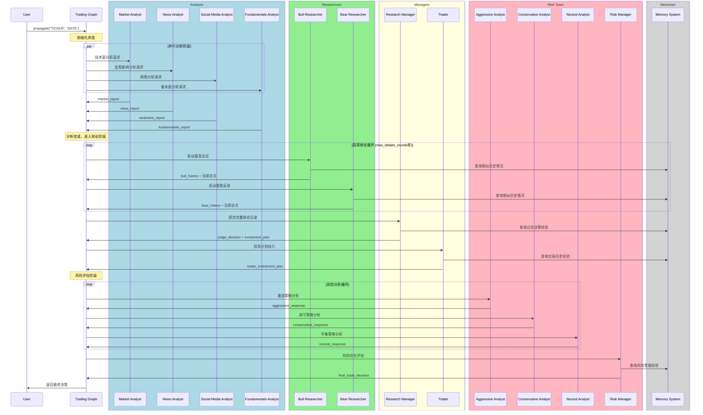
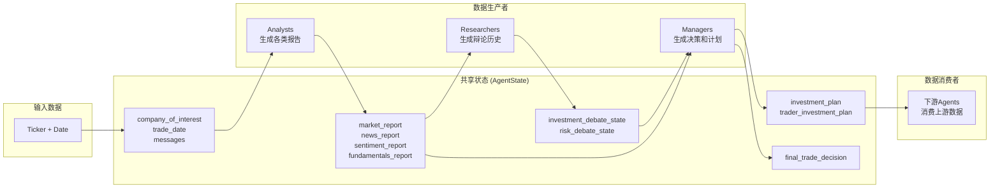
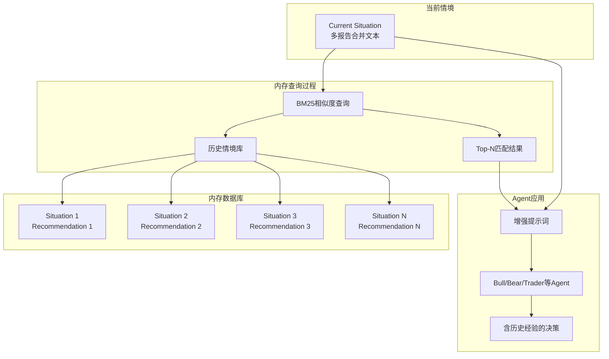
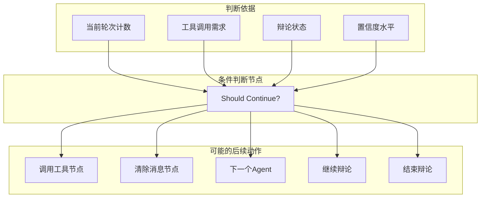

# TradingAgents 系统架构图

## 整体架构概览

```mermaid
graph TB
    subgraph "用户接口层"
        A[TradingAgentsGraph] --> B[propagate()]
    end
    
    subgraph "数据接入层"
        C[Yahoo Finance]
        D[Alpha Vantage]
        E[Data Interface Layer]
        C --> E
        D --> E
    end
    
    subgraph "工具服务层"
        E --> F[Stock Data Tools]
        E --> G[Indicator Tools]
        E --> H[Fundamental Tools]
        E --> I[News Tools]
    end
    
    subgraph "分析Agent层"
        F --> J[Market Analyst<br/>技术分析]
        G --> J
        I --> K[News Analyst<br/>宏观新闻]
        I --> L[Social Media Analyst<br/>舆情分析]
        H --> M[Fundamentals Analyst<br/>基本面分析]
    end
    
    subgraph "辩论Agent层"
        J --> N[Bull Researcher<br/>看涨观点]
        K --> N
        L --> N
        M --> N
        J --> O[Bear Researcher<br/>看跌观点]
        K --> O
        L --> O
        M --> O
    end
    
    subgraph "决策管理层"
        N --> P[Research Manager<br/>投资判决]
        O --> P
        P --> Q[Trader<br/>交易计划]
        Q --> R[Aggressive Analyst<br/>激进策略]
        Q --> S[Conservative Analyst<br/>保守策略]
        Q --> T[Neutral Analyst<br/>平衡策略]
        R --> U[Risk Manager<br/>最终决策]
        S --> U
        T --> U
    end
    
    subgraph "记忆系统"
        V[Bull Memory]
        W[Bear Memory]
        X[Trader Memory]
        Y[Invest Judge Memory]
        Z[Risk Manager Memory]
        V --> N
        W --> O
        X --> Q
        Y --> P
        Z --> U
    end
    
    B --> J
    B --> K
    B --> L
    B --> M
    U --> B
```

## 详细工作流图



## Agent间数据流向图



## 内存系统交互图



## 条件控制逻辑图



## 图表说明

以上图表展示了TradingAgents系统的完整架构：

1. **分层架构**：清晰的数据流和职责分离
2. **并行处理**：多个分析师同时工作提高效率
3. **辩论机制**：通过对抗性讨论提升决策质量
4. **记忆系统**：基于历史经验的学习和改进
5. **条件控制**：灵活的工作流管理和终止条件

## 系统组件说明

### 主要模块
- **用户接口层**: TradingAgentsGraph主类和propagate方法
- **数据接入层**: Yahoo Finance和Alpha Vantage数据源
- **工具服务层**: 各类数据获取和处理工具
- **分析Agent层**: 四类专业分析师并行工作
- **辩论Agent层**: 看涨/看跌研究员对抗辩论
- **决策管理层**: 研究经理和风险经理决策
- **记忆系统**: BM25算法实现的经验学习

### 工作流程
1. 用户发起交易请求
2. 多个分析师并行分析不同维度数据
3. 研究员基于分析结果进行辩论
4. 管理层综合评估做出投资决策
5. 风险团队进行风险管控
6. 输出最终交易建议

这些可视化图表帮助理解系统的复杂交互关系和数据流动方式。