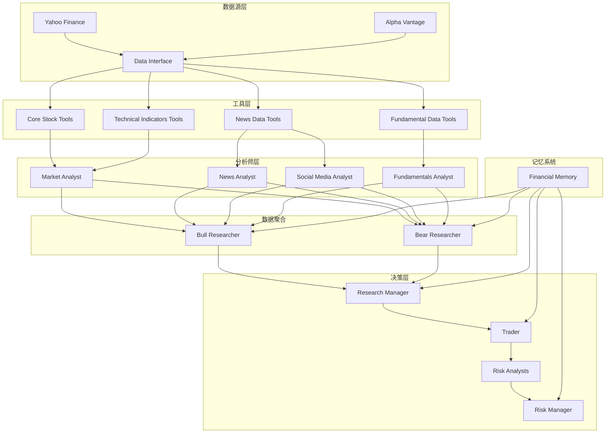
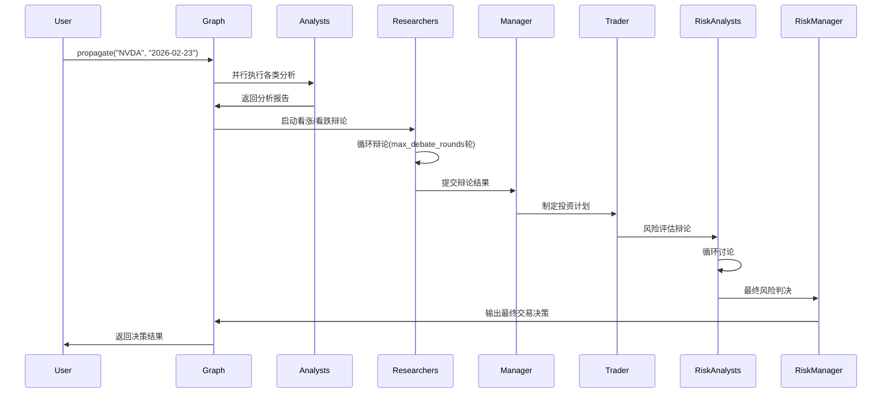

# TradingAgents 系统架构分析报告

## 1. 系统概述

TradingAgents是一个基于多Agent协作的股票交易决策系统，采用LangGraph框架构建复杂的工作流。系统通过多个专业化的AI Agent协同工作，从不同维度分析市场信息并做出投资决策。

## 2. 核心Agent类及其关联关系

### 2.1 分析师层 (Analysts Layer)

#### 市场分析师 (Market Analyst)
- **文件路径**: `tradingagents/agents/analysts/market_analyst.py`
- **主要职责**: 技术面分析，选择合适的指标进行趋势判断
- **依赖工具**: 
  - `get_stock_data`: 获取股票基础数据
  - `get_indicators`: 计算技术指标
- **输出**: `market_report` (市场研究报告)

#### 新闻分析师 (News Analyst)  
- **文件路径**: `tradingagents/agents/analysts/news_analyst.py`
- **主要职责**: 宏观经济新闻和全球事件分析
- **依赖工具**:
  - `get_news`: 公司特定新闻搜索
  - `get_global_news`: 全球宏观经济新闻
- **输出**: `news_report` (新闻分析报告)

#### 基本面分析师 (Fundamentals Analyst)
- **文件路径**: `tradingagents/agents/analysts/fundamentals_analyst.py`
- **主要职责**: 财务数据分析和公司基本面评估
- **依赖工具**:
  - `get_fundamentals`: 综合公司分析
  - `get_balance_sheet`: 资产负债表
  - `get_cashflow`: 现金流量表
  - `get_income_statement`: 损益表
- **输出**: `fundamentals_report` (基本面分析报告)

#### 社交媒体分析师 (Social Media Analyst)
- **文件路径**: `tradingagents/agents/analysts/social_media_analyst.py`
- **主要职责**: 社交媒体情绪分析和公众舆论监测
- **依赖工具**:
  - `get_news`: 新闻和社交媒体内容搜索
- **输出**: `sentiment_report` (情绪分析报告)

### 2.2 研究员层 (Researchers Layer)

#### 看涨研究员 (Bull Researcher)
- **文件路径**: `tradingagents/agents/researchers/bull_researcher.py`
- **主要职责**: 构建看涨投资论点
- **输入来源**:
  - 所有分析师报告 (`market_report`, `sentiment_report`, `news_report`, `fundamentals_report`)
  - 熊市研究员的最新论点
  - 历史记忆中的经验教训
- **输出**: `investment_debate_state.bull_history` (看涨辩论历史)

#### 看跌研究员 (Bear Researcher)
- **文件路径**: `tradingagents/agents/researchers/bear_researcher.py`
- **主要职责**: 构建看跌投资论点
- **输入来源**: 同看涨研究员
- **输出**: `investment_debate_state.bear_history` (看跌辩论历史)

### 2.3 管理层 (Managers Layer)

#### 研究经理 (Research Manager/Judge)
- **文件路径**: `tradingagents/agents/managers/research_manager.py`
- **主要职责**: 主持投资辩论并做出最终投资决策
- **输入来源**:
  - 双方辩论历史
  - 所有分析师报告
  - 过往相似情况的记忆
- **输出**: 
  - `investment_debate_state.judge_decision` (投资判决)
  - `investment_plan` (投资计划)

#### 风险经理 (Risk Manager/Judge)
- **文件路径**: `tradingagents/agents/managers/risk_manager.py`
- **主要职责**: 风险评估和最终交易决策
- **输入来源**:
  - 风险分析师辩论结果
  - 交易员投资计划
  - 多维度分析报告
- **输出**: `final_trade_decision` (最终交易决策)

### 2.4 交易执行层 (Trader Layer)

#### 交易员 (Trader)
- **文件路径**: `tradingagents/agents/trader/trader.py`
- **主要职责**: 基于投资计划制定具体交易策略
- **输入来源**:
  - 研究经理的投资计划
  - 所有分析师报告
  - 历史交易记忆
- **输出**: `trader_investment_plan` (交易投资计划)

### 2.5 风险分析师层 (Risk Analysts Layer)

#### 激进型分析师 (Aggressive Debator)
- **文件路径**: `tradingagents/agents/risk_mgmt/aggressive_debator.py`
- **职责**: 提出高风险高回报的交易策略

#### 保守型分析师 (Conservative Debator)
- **文件路径**: `tradingagents/agents/risk_mgmt/conservative_debator.py`
- **职责**: 提出低风险稳健的交易策略

#### 中性分析师 (Neutral Debator)
- **文件路径**: `tradingagents/agents/risk_mgmt/neutral_debator.py`
- **职责**: 提出平衡风险收益的交易策略

## 3. 数据引用关系图



## 4. 工作流程图



## 5. 提示词(Prompt)体系分析

### 5.1 分析师提示词模板

#### 市场分析师核心提示词:
```
"You are a trading assistant tasked with analyzing financial markets..."
关键要素:
- 指标选择指导(最多8个指标)
- 冗余避免策略
- 详细趋势分析要求
- Markdown表格输出格式
```

#### 新闻分析师核心提示词:
```
"You are a news researcher tasked with analyzing recent news and trends..."
关键要素:
- 时间范围限定(过去一周)
- 工具使用指导(get_news, get_global_news)
- 详细分析深度要求
```

#### 基本面分析师核心提示词:
```
"You are a researcher tasked with analyzing fundamental information..."
关键要素:
- 财务文档全面分析
- 四大财务报表覆盖
- 工具调用规范说明
```

#### 社交媒体分析师核心提示词:
```
"You are a social media and company specific news researcher/analyst..."
关键要素:
- 社交媒体情绪监测
- 公众舆论分析
- 多源信息整合
```

### 5.2 研究员辩论提示词

#### 看涨研究员提示词结构:
```
"You are a Bull Analyst advocating for investing in the stock..."
重点内容:
- 成长潜力强调
- 竞争优势分析
- 积极指标利用
- 熊市观点反驳
- 对话式辩论风格
```

#### 看跌研究员提示词结构:
```
"You are a Bear Analyst making the case against investing in the stock..."
重点内容:
- 风险挑战识别
- 竞争劣势分析
- 负面指标利用
- 牛市观点反驳
- 对话式辩论风格
```

### 5.3 管理者决策提示词

#### 研究经理提示词:
```
"As the portfolio manager and debate facilitator..."
决策要求:
- 明确的买入/卖出/持有决定
- 关键论点总结
- 详细投资计划制定
- 过往错误反思应用
```

#### 风险经理提示词:
```
"As the Risk Management Judge and Debate Facilitator..."
风险评估要素:
- 三方分析师观点综合
- 交易计划优化调整
- 历史教训学习应用
- 清晰的风险收益权衡
```

### 5.4 交易员提示词:
```
"You are a trading agent analyzing market data to make investment decisions..."
执行要点:
- 团队分析结果应用
- 具体买卖建议
- 历史经验借鉴
- 最终决策格式化输出
```

## 6. 内存系统架构

### 6.1 FinancialSituationMemory 类
- **位置**: `tradingagents/agents/utils/memory.py`
- **算法**: BM25 (Best Matching 25) 文本相似度匹配
- **特点**: 无需API调用，离线工作，支持任意LLM提供商

### 6.2 内存使用模式
每个主要Agent都有专属内存:
- `bull_memory`: 看涨研究员记忆
- `bear_memory`: 看跌研究员记忆  
- `trader_memory`: 交易员记忆
- `invest_judge_memory`: 投资法官记忆
- `risk_manager_memory`: 风险经理记忆

### 6.3 记忆检索机制
- 使用当前情境文本进行BM25相似度匹配
- 返回最相似的历史情况和对应建议
- 支持返回多个匹配结果(n_matches参数)

## 7. 条件逻辑控制

### 7.1 辩论轮次控制
- `max_debate_rounds`: 投资辩论最大轮次数(默认值在配置中)
- `max_risk_discuss_rounds`: 风险分析讨论轮次数

### 7.2 工具调用条件
每个分析师节点都有对应的条件判断:
- `should_continue_market()`: 市场分析师是否继续调用工具
- `should_continue_social()`: 社交媒体分析师工具调用判断
- `should_continue_news()`: 新闻分析师工具调用判断
- `should_continue_fundamentals()`: 基本面分析师工具调用判断

### 7.3 辩论终止条件
- 达到最大辩论轮次
- Agent认为已充分论证观点
- 系统判断可以进入下一阶段

## 8. 系统配置参数

### 8.1 LLM配置
```python
config = {
    "deep_think_llm": "gpt-5-mini",     # 深度思考模型
    "quick_think_llm": "gpt-5-mini",    # 快速响应模型
    "llm_provider": "openai",           # LLM提供商
    "backend_url": None,                # 自定义后端URL(可选)
}
```

### 8.2 数据源配置
```python
"data_vendors": {
    "core_stock_apis": "yfinance",      # 核心股票API
    "technical_indicators": "yfinance", # 技术指标数据源
    "fundamental_data": "yfinance",     # 基本面数据源
    "news_data": "yfinance",            # 新闻数据源
}
```

### 8.3 辩论参数
```python
"max_debate_rounds": 1,              # 最大辩论轮次
"max_risk_discuss_rounds": 3,        # 风险讨论轮次
```

## 9. 系统优势与特色

### 9.1 多维度分析
- 技术面、基本面、消息面、情绪面四维分析
- 专业化分工确保分析深度

### 9.2 辩论机制
- 看涨vs看跌研究员对抗辩论
- 风险分析师三方观点碰撞
- 促进更全面的风险考量

### 9.3 学习记忆
- BM25离线记忆系统
- 历史经验自动应用
- 持续优化决策质量

### 9.4 灵活配置
- 可选择启用的分析师类型
- 可调节的辩论轮次
- 支持多种LLM提供商

### 9.5 可追溯性
- 完整状态日志记录
- 决策过程透明化
- 便于回测和优化

这个系统设计体现了现代AI Agent协作的理念，通过专业化分工和辩论机制来提高决策质量，同时结合记忆系统实现持续学习改进。